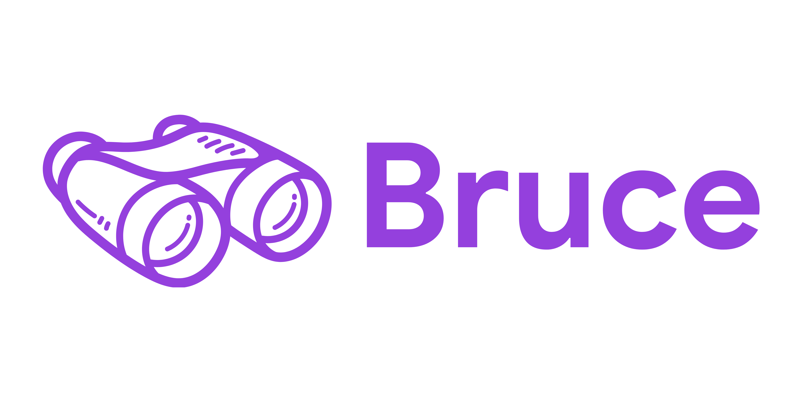
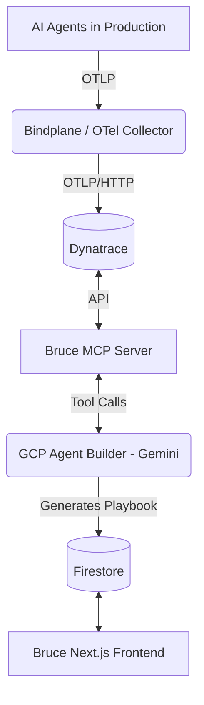

# Bruce

<p align="center">
  
</p>

**Bruce** is an open-source AI Observability Copilot that watches your AI agents in production — detecting anomalies, diagnosing root causes, and generating fix playbooks automatically, so your agents behave the way you expect, at every scale.

Built with [Google Cloud Agent Builder](https://cloud.google.com/products/agent-builder) + Gemini, powered by [Dynatrace](https://www.dynatrace.com/) via Model Context Protocol (MCP).

[](LICENSE)
[](https://github.com/monodox/bruce)

## Architecture



**Three layers:**

1. **Telemetry Layer** — Agents export traces/metrics via OpenTelemetry → Bindplane → Dynatrace
2. **Diagnosis Layer** — MCP Server bridges Dynatrace API to the diagnostic agent
3. **Copilot Layer** — Gemini-powered agent in GCP Agent Builder analyzes failures and generates fix playbooks

## Tech Stack

| Layer | Technology |
|-------|-----------|
| Frontend | Next.js 16, React 19, TypeScript, Tailwind CSS v4, shadcn/ui |
| Backend | Node.js 24+, Express 5, TypeScript |
| MCP Server | `@modelcontextprotocol/sdk` ^1.18, TypeScript |
| Agent | Google Cloud Agent Builder, Gemini (gemini-3.5-flash) |
| Observability | Dynatrace, Bindplane, OpenTelemetry |
| Infrastructure | GCP (Cloud Run), Docker, Terraform |
| Monorepo | pnpm 10+ workspaces, Turborepo |

## Getting Started

### Prerequisites

- Node.js 24+
- pnpm 10+
- Docker (optional, for full stack)

### Installation

```bash
# Clone the repository
git clone https://github.com/monodox/bruce.git
cd bruce

# Install dependencies
pnpm install

# Copy environment variables
cp .env.example .env.local

# Start the development server
pnpm dev
```

Open [http://localhost:3000](http://localhost:3000) in your browser.

### Docker

```bash
docker compose up
```

This starts the frontend, backend, MCP server, and a local OTel collector.

## Scripts

| Command | Description |
|---------|-------------|
| `pnpm dev` | Start all services in dev mode |
| `pnpm build` | Build all packages |
| `pnpm lint` | Lint all packages |
| `pnpm test` | Run tests |

## Project Structure

```
bruce/
├── agent-builder/    # GCP Agent Builder prompts & config
├── backend/          # Express API (webhooks, playbook storage)
├── docs/             # Architecture documentation
├── frontend/         # Next.js web console
├── infra/            # Terraform, Bindplane, Dynatrace configs
├── mcp-server/       # Dynatrace MCP Server
└── packages/         # Shared packages (SDK, types)
    ├── sdk-node/     # Node.js OpenTelemetry wrapper
    ├── sdk-python/   # Python OpenTelemetry wrapper
    └── shared-types/ # Shared TypeScript interfaces
```

## Contributing

We welcome contributions! Please read [CONTRIBUTING.md](CONTRIBUTING.md) for details on our code of conduct and the process for submitting pull requests.

## License

This project is licensed under the MIT License — see the [LICENSE](LICENSE) file for details.

## Security

Please see [SECURITY.md](SECURITY.md) for reporting vulnerabilities.

## Links

- **Repository:** https://github.com/monodox/bruce
- **Issues:** https://github.com/monodox/bruce/issues
- **Discussions:** https://github.com/monodox/bruce/discussions

## Live Deployment

| Service | URL |
|---------|-----|
| Frontend (Console) | https://bruce-frontend-200902967092.us-central1.run.app |
| Backend (API) | https://bruce-backend-200902967092.us-central1.run.app |
| MCP Server | https://bruce-mcp-server-200902967092.us-central1.run.app |

**GCP Project:** `bruce-499005` | **Region:** `us-central1` | **Dynatrace:** `ens66072.live.dynatrace.com`
