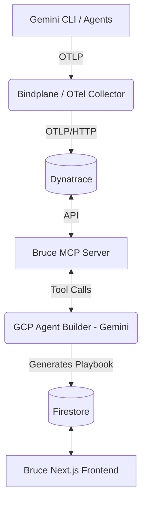

# System Architecture

Bruce is composed of three primary layers that work together to provide continuous observability for AI agents.

## 1. The Telemetry Layer
Agents in the wild (e.g., Gemini CLI) are instrumented with OpenTelemetry. They export their traces, metrics, and logs (token usage, tool calls, errors) over gRPC/HTTP to a centralized collector.
- **Bindplane (Google Edition)** / **OTel Collector**: Receives the raw telemetry and routes it securely to the observability backend.
- **Dynatrace**: Acts as the system of record. It stores the telemetry and provides the unified dashboards for human operators.

## 2. The Diagnosis Layer (MCP Server)
Bruce introduces a **Model Context Protocol (MCP)** server. This server connects directly to the Dynatrace API.
- It exposes predefined tools like `get_failing_traces` and `get_token_metrics`.
- It acts as a standardized bridge, ensuring that the diagnostic AI agent doesn't need to understand complex DQL (Dynatrace Query Language) directly.

## 3. The Copilot Layer (GCP Agent Builder)
A Gemini-powered diagnostic agent is hosted in **Google Cloud Agent Builder**.
- When an anomaly is detected (e.g., token spike), this agent is triggered via webhook.
- It uses the MCP server to pull the failing traces from Dynatrace.
- It analyzes the LLM hallucination loops or tool failures and generates a "Fix Playbook".
- The Playbook is saved to Firestore and surfaced via the Bruce Frontend (Next.js) for developers to review.

